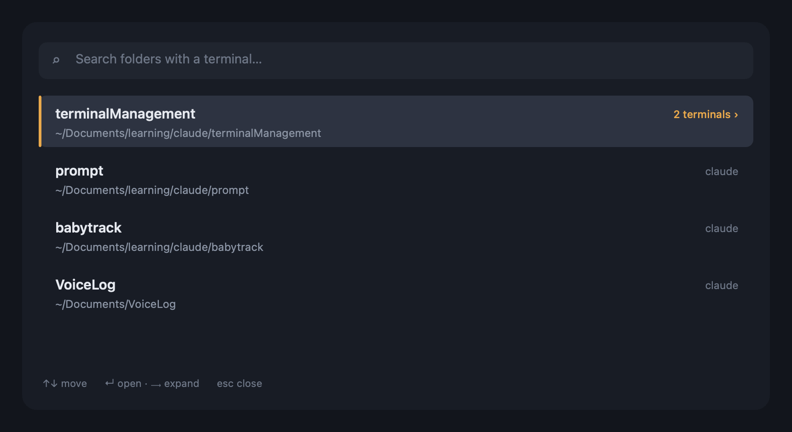

# Terminal Session Manager

**Stop hunting through terminal tabs. Jump to the right folder in two keystrokes — and never open a duplicate again.**

If you keep a dozen terminals open — one per project, some running `claude`, some just a shell — you know the pain: clicking tab after tab to find the one folder you want, and accidentally opening a *third* terminal for a folder you already had open. This fixes both.

Press a hotkey, type a few letters of a folder name, hit **↵** — you're there. Ask for a folder you don't have open yet, and it opens one; ask for one you *do* have open, and it jumps to it instead of piling on another.



<p align="center">
  
  
  
  
</p>

---

## Why you'll like it

- 🔎 **Find any terminal by folder** — one searchable list of every folder that has a terminal open, with fuzzy search. No more clicking through tabs.
- ♻️ **Reuse, don't duplicate** — open a folder and it *focuses the terminal you already have there*. A new one is created only when none exists.
- 🧠 **Knows what's running** — a folder with a Claude tab *and* a plain shell shows both, labelled `claude` / `shell`, so you pick the exact one.
- 🖥️ **Works with Terminal.app *and* iTerm2** — at the same time.
- 🔌 **No third-party apps** — a tiny native menu-bar app (⌥Space) *and* a shell command. Both are self-contained; the only runtime is Node.
- ⚡ **No daemon, nothing to sync** — it reads live state each time, so a tab you closed simply isn't there.

## Two ways to use it — pick either

| | What it is | Trigger |
|---|---|---|
| **Menu-bar app** | A native macOS app — a `>_` menu-bar icon + a floating search panel | **⌥Space** (or click the icon) |
| **`tm` command** | A shell function (bash + zsh) | type `tm` in any terminal |

Both are driven by the same engine, so they behave identically.

---

## Install

```bash
git clone https://github.com/DatHT/TerminalSession.git
cd TerminalSession
```

You need **Node.js** (the engine runs on it) and, for the app, the **Xcode command-line tools** (`xcode-select --install`).

### The menu-bar app

```bash
bash app/build.sh                 # compiles app/build/Terminal Sessions.app
open app/build                    # drag "Terminal Sessions.app" into /Applications
open "/Applications/Terminal Sessions.app"
```

Press **⌥Space** to summon the search panel. On the first focus/open, click **OK** on *"…wants to control Terminal.app."* Right-click the menu-bar icon for **Open at Login / Refresh / Quit**.

> The global hotkey needs no Accessibility permission. If ⌥Space is taken it falls back to ⌃⌥Space → ⌥⌘T (shown in the icon tooltip). You can also trigger it with `open terminalsessions://`.

### The `tm` command (optional)

```bash
brew install fzf                                  # optional, for fuzzy search
echo '. "'"$PWD"'/shell/tm.sh"' >> ~/.zshrc       # and/or ~/.bash_profile
exec $SHELL -l
```

---

## Using it

Summon the panel, then:

- **Type** part of a folder name — the list filters instantly.
- **↑ / ↓** move, **↵** open, **Esc** close.
- A folder with **one** terminal → **↵** jumps straight to it.
- A folder with **several** terminals shows `N terminals ›` → press **→** (or **↵**) to expand and pick the exact one (`claude`, `shell`, `python`, …). **←** / **Esc** goes back.
- Type a path (`~/dev/newthing`) that isn't open yet → **↵** opens a terminal there.

`tm` from the shell:

```
tm                 fuzzy-pick a folder → focus it (or open one)
tm api             pre-filter by name
tm ~/dev/foo       reuse the terminal there, or open a new one
tm ls              list every folder with an open terminal
tm doctor          diagnostics / permission check
```

---

## How it works

No daemon. Each time you open it, the engine:

1. asks Terminal.app and iTerm2 (via AppleScript) for every open tab and its **TTY**;
2. reads each tab's **current working directory** from that TTY (`ps` → foreground process → `lsof`) — correct even when `claude` or a REPL is running in it;
3. groups tabs by folder and labels each by what's running;
4. on select, focuses the exact tab (iTerm2 by stable session id, Terminal.app by window + TTY) — or opens a new window `cd`'d into the folder.

```
app/                  native menu-bar app (Swift / AppKit)
shell/tm.sh           the `tm` shell command
assets/tm/            the engine — dependency-free Node ESM (shared by every front-end)
src/                  optional Raycast extension
docs/                 demo assets
```

Want a Raycast front-end instead? An extension lives in `src/` — `npm install && npm run dev`.

---

## Requirements

macOS 13+ · Node.js · Xcode command-line tools (to build the app) · optionally `fzf` for the shell picker. No Accessibility permission; a one-time Automation permission for controlling your terminal.

## License

[MIT](LICENSE)
